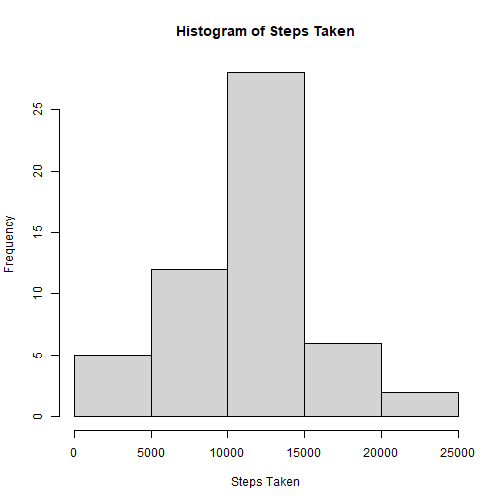
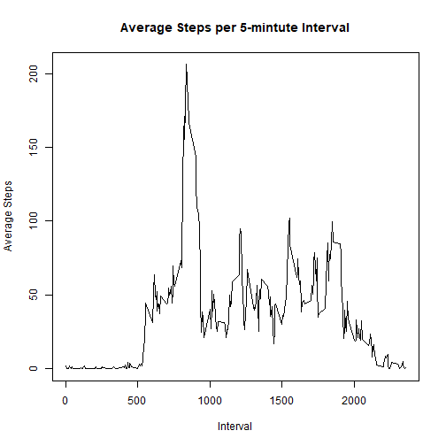
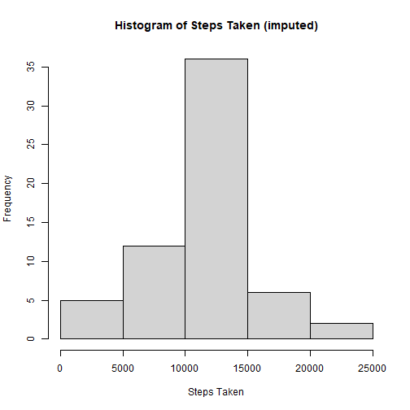
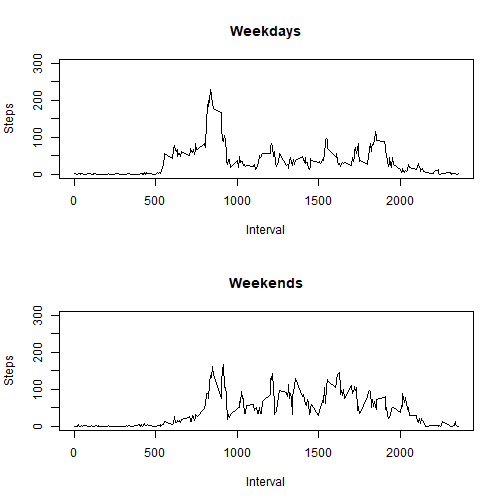

## About This Project
The goal of this project was to analyze activity monitoring data collected from 
a personal monitoring device. Data were collected from October to November 2012.
 Data were collected every five minutes throughout each day.  
 
Data source: [https://d396qusza40orc.cloudfront.net/repdata%2Fdata%2Factivity.zip](https://d396qusza40orc.cloudfront.net/repdata%2Fdata%2Factivity.zip) \
*accessed by the author on August 28, 2022*

Loading and preprocessing the data
Show any code that is needed to \
* Load the data (i.e. read.csv())  
* Process/transform the data (if necessary) into a format suitable for your 
analysis


```r
# load libraries
library(tidyverse)
```

```
## -- Attaching packages -------- tidyverse 1.3.1 --
```

```
## v ggplot2 3.3.5     v purrr   0.3.4
## v tibble  3.1.2     v dplyr   1.0.7
## v tidyr   1.1.4     v stringr 1.4.0
## v readr   2.0.0     v forcats 0.5.1
```

```
## Warning: package 'ggplot2' was built under R
## version 4.1.1
```

```
## Warning: package 'tidyr' was built under R
## version 4.1.1
```

```
## Warning: package 'dplyr' was built under R
## version 4.1.1
```

```
## -- Conflicts ----------- tidyverse_conflicts() --
## x dplyr::filter() masks stats::filter()
## x dplyr::lag()    masks stats::lag()
```

```r
# download "activity.zip" data file if it doesn't exist in working directory
# NOTE: "activity.zip" included from forked repository at
# http://github.com/rdpeng/RepData_PeerAssessment1 on August 28, 2022
if (!file.exists("activity.zip")) {
  download.file("https://d396qusza40orc.cloudfront.net/repdata%2Fdata%2Factivity.zip",
                "activity.zip")
}

# unzip "activity.zip" file and read "activity.csv" to dataframe
unzip("activity.zip")
activity_data <- read.csv("activity.csv")
```

## What is mean total number of steps taken per day?
For this part of the assignment, you can ignore the missing values in the
dataset.  
* Make a histogram of the total number of steps taken each day  
* Calculate and report the mean and median total number of steps taken per day


```r
# calculate total steps by date
mean_steps <- activity_data %>% 
  group_by(date) %>% 
  summarize(steps = sum(steps))

# create histogram of steps taken
hist(mean_steps$steps, xlab = "Steps Taken", main = "Histogram of Steps Taken")
```



```r
# calculate mean of number of steps taken per day
mean(mean_steps$steps, na.rm = TRUE)
```

```
## [1] 10766.19
```

```r
# calculate median of number of steps taken per day
median(mean_steps$steps, na.rm = TRUE)
```

```
## [1] 10765
```

## WHAT IS THE AVERAGE DAILY ACTIVITY PATTERN?
- Make a time series plot (i.e. type = "l") of the 5-minute interval (x-axis) 
and the average number of steps taken, averaged across all days (y-axis)  
- Which 5-minute interval, on average across all the days in the dataset, 
contains the maximum number of steps?


```r
# calculate average steps by interval
activity_pattern <-
  activity_data %>% 
  group_by(interval) %>% 
  summarize(average_steps = mean(steps, na.rm = TRUE))

# create line graph of activity pattern
with(activity_pattern, plot(interval, average_steps, type = "l", 
                            xlab = "Interval", ylab = "Average Steps", 
                            main = "Average Steps per 5-mintute Interval"))
```



```r
# determine interval with most average steps
activity_pattern$interval[which.max(activity_pattern$average_steps)]
```

```
## [1] 835
```

## IMPUTING MISSING VALUES
Note that there are a number of days/intervals where there are missing values
(coded as NA). The presence of missing days may introduce bias into some
calculations or summaries of the data.  
- Calculate and report the total number of missing values in the dataset (i.e. 
the total number of rows with NAs)  
- Devise a strategy for filling in all of the missing values in the dataset.
 The strategy does not need to be sophisticated. For example, you could use the 
 mean/median for that day, or the mean for that 5-minute interval, etc.
- Create a new dataset that is equal to the original dataset but with the 
missing data filled in.  
- Make a histogram of the total number of steps taken each day and  
- Calculate and report the mean and median total number of steps taken per day.
 Do these values differ from the estimates from the first part of the 
 assignment? What is the impact of imputing missing data on the estimates of 
 the total daily number of steps?  


```r
# count total NAs in activity data
with(activity_data, sum(is.na(steps)))
```

```
## [1] 2304
```

```r
# replace NAs in activity data with average; for 5-minute interval; create as a
# separate dataframe
activity_data_imputed <- merge(activity_data, activity_pattern)
for (i in 1:nrow(activity_data_imputed)) {
  if (is.na(activity_data_imputed$steps[i])) {
    activity_data_imputed[i, "steps"] <- activity_data_imputed[i, "average_steps"]
  }
}

# calculate total steps by date for imputed data
mean_steps_imputed <- activity_data_imputed %>% 
  group_by(date) %>% 
  summarize(steps = sum(steps))

# create histogram of steps taken for imputed data
hist(mean_steps_imputed$steps, xlab = "Steps Taken", main = "Histogram of Steps Taken (imputed)")
```



```r
# calculate mean of number of steps taken per day for imputed data
mean(mean_steps_imputed$steps, na.rm = TRUE)
```

```
## [1] 10766.19
```

```r
# calculate median of number of steps taken per day for imputed data
median(mean_steps_imputed$steps)
```

```
## [1] 10766.19
```

Imputing the average 5-minute interval across all days for every NA instance
resulted in a neglible change in both the mean and median. Doing so raised the
median by just over one step.

## ARE THERE DIFFERENCES IN ACTIVITY PATTERNS BETWEEN WEEKDAYS AND WEEKENDS?
For this part the weekdays() function may be of some help here. Use the dataset 
with the filled-in missing values for this part.  
- Create a new factor variable in the dataset with two levels -- "weekday" and 
"weekend" indicating whether a given date is a weekday or weekend day. \
- Make a panel plot containing a time series plot (i.e. type = "l") of the 
5-minute interval (x-axis) and the average number of steps taken, averaged
across all weekday days or weekend days (y-axis).


```r
# append column for day type
for (i in 1:nrow(activity_data_imputed)) {
  if (weekdays(as.Date(activity_data_imputed$date[i])) %in% 
      c("Sunday", "Saturday")) {
    activity_data_imputed$day_type[i] <- "weekend"
  } else {
    activity_data_imputed$day_type[i] <- "weekday"
  }
}

# create dataframe for activity by day type and 5-minute interval
day_type_data <-
  activity_data_imputed %>% 
  group_by(day_type, interval) %>% 
  summarize(steps = mean(steps))
```

```
## `summarise()` has grouped output by 'day_type'. You can override using the `.groups` argument.
```

```r
# create panel plot of time series showing average steps per 5-minute interval
# by day type
par(mfrow = c(2, 1))
with(filter(day_type_data, day_type == "weekday"), plot(interval, steps,
                                                        type = "l",
                                                        main = "Weekdays",
                                                        xlab = "Interval", 
                                                        ylab = "Steps",
                                                        ylim = c(0, 300)))
with(filter(day_type_data, day_type == "weekend"), plot(interval, steps,
                                                        type = "l",
                                                        main = "Weekends",
                                                        xlab = "Interval", 
                                                        ylab = "Steps",
                                                        ylim = c(0, 300)))
```


